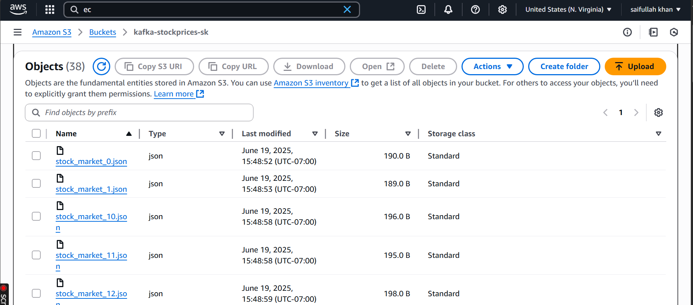
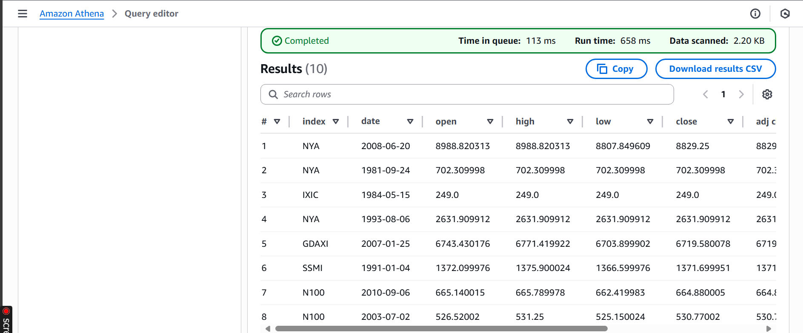

# Real-Time Stock Streaming Pipeline with Kafka and AWS

## Project Overview

This project demonstrates a real-time stock market data streaming pipeline using **Apache Kafka**, **Python**, and **AWS services**.

The pipeline simulates stock market data, streams it through Kafka, stores the processed data in **Amazon S3**, catalogs it using **AWS Glue**, and queries it using **Amazon Athena**.

This project shows how real-time data can be ingested, stored, and analyzed using a cloud-based data engineering architecture.

---

## Problem Statement

Stock market data changes continuously, and businesses need fast access to fresh data for analysis, dashboards, and decision-making. Traditional batch processing is not always suitable for this type of data because it may introduce delays.

The problem is to build a real-time data pipeline that can:

* Generate or simulate live stock market data
* Stream data continuously using Kafka
* Consume and store the streamed data
* Save the data in a scalable cloud storage system
* Make the data queryable for analytics
* Support future dashboarding and reporting

This project solves the problem by using **Apache Kafka** for streaming and **AWS S3, Glue, and Athena** for cloud storage and analytics.

---

## Solution

The solution uses a Python producer to simulate stock market records and send them to a Kafka topic. A Kafka consumer reads the records from the topic and stores them in Amazon S3.

AWS Glue is then used to create a data catalog for the stored files, and Amazon Athena is used to run SQL queries directly on the S3 data.

This creates a simple but powerful real-time data pipeline from streaming ingestion to cloud analytics.

---

## Architecture

```text
Python Stock Data Producer
          |
          v
Apache Kafka Topic on AWS EC2
          |
          v
Python Kafka Consumer
          |
          v
Amazon S3 Data Lake
          |
          v
AWS Glue Data Catalog
          |
          v
Amazon Athena SQL Queries
          |
          v
Analytics / Reporting
```

### Architecture Diagram


---

## Architecture Flow

### 1. Python Producer

The producer simulates real-time stock market data and sends records to a Kafka topic.

The generated stock records may include fields such as:

* Stock symbol
* Price
* Volume
* Timestamp
* Market movement

The producer is responsible for continuously pushing data into Kafka.

---

### 2. Apache Kafka on AWS EC2

Kafka is hosted on an AWS EC2 instance.
Kafka acts as the streaming platform between the producer and consumer.

Kafka is used because it can handle continuous event streams and allows data to move in real time between systems.

---

### 3. Python Consumer

The consumer reads stock market records from the Kafka topic.

After consuming the data, it writes the records into Amazon S3 for cloud storage.

This step moves data from the streaming layer into the storage layer.

---

### 4. Amazon S3 Data Lake

Amazon S3 is used as the raw data storage layer.

S3 stores the consumed stock data files and acts as a cloud data lake. This makes the data scalable, durable, and available for analytics.

### Amazon S3 Stored Data Screenshot



---

### 5. AWS Glue Data Catalog

AWS Glue is used to detect and catalog the schema of the data stored in S3.

The Glue Data Catalog makes the S3 data understandable for query engines like Amazon Athena.

---

### 6. Amazon Athena

Amazon Athena is used to query the data stored in S3 using SQL.

With Athena, the stock data can be analyzed without moving it into a traditional database.

### Amazon Athena Query Result Screenshot



---

## Tech Stack

| Category                | Tool / Service   |
| ----------------------- | ---------------- |
| Programming Language    | Python           |
| Streaming Platform      | Apache Kafka     |
| Cloud Compute           | AWS EC2          |
| Cloud Storage           | Amazon S3        |
| Data Catalog            | AWS Glue         |
| Query Engine            | Amazon Athena    |
| Development Environment | Jupyter Notebook |
| Version Control         | GitHub           |

---

## Repository Structure

```text
.
├── imgs/
│   ├── architecture.png
│   ├── s3-data.png
│   └── athena-query-result.png
│
├── notebooks/
│   ├── producer.ipynb
│   └── consumer.ipynb
│
└── README.md
```

---

## Key Features

* Real-time stock data simulation
* Kafka producer and consumer workflow
* Kafka broker hosted on AWS EC2
* Streaming ingestion using Apache Kafka
* Data storage in Amazon S3
* Schema cataloging using AWS Glue
* SQL analytics using Amazon Athena
* Cloud-based data engineering architecture
* Foundation for real-time dashboards and reporting

---

## How the Pipeline Works

1. The Python producer generates simulated stock market data.
2. The producer sends the data into an Apache Kafka topic.
3. Kafka runs on an AWS EC2 instance.
4. The Python consumer reads messages from the Kafka topic.
5. The consumer writes the data into Amazon S3.
6. AWS Glue catalogs the data stored in S3.
7. Amazon Athena queries the S3 data using SQL.
8. The final data can be used for analytics, dashboards, and reporting.


---

## Example Business Questions

This pipeline can help answer questions such as:

* Which stock symbol has the highest price movement?
* What is the average price of each stock?
* How many records were streamed in a specific time period?
* Which stocks had the highest trading volume?
* How does stock price change over time?
* How can real-time stock data be stored for future analysis?

---

## Example Athena Queries

### View All Stock Records

```sql
SELECT *
FROM stock_data
LIMIT 10;
```

### Average Price by Stock Symbol

```sql
SELECT 
    symbol,
    AVG(price) AS average_price
FROM stock_data
GROUP BY symbol
ORDER BY average_price DESC;
```

### Count Records by Stock Symbol

```sql
SELECT 
    symbol,
    COUNT(*) AS total_records
FROM stock_data
GROUP BY symbol
ORDER BY total_records DESC;
```

### Highest Stock Price

```sql
SELECT 
    symbol,
    MAX(price) AS highest_price
FROM stock_data
GROUP BY symbol
ORDER BY highest_price DESC;
```

---

## Business Value

This project demonstrates how real-time stock data can be collected, stored, and queried in a cloud environment.

Business benefits include:

* Faster access to stock market data
* Scalable cloud storage using S3
* Real-time data ingestion using Kafka
* Low-cost SQL analytics using Athena
* Better support for dashboards and reporting
* Foundation for financial analytics and alerting systems

---

## Challenges Faced

Some challenges in this project included:

* Setting up Kafka on AWS EC2
* Configuring Kafka producer and consumer correctly
* Managing data flow from Kafka to S3
* Understanding how streaming data differs from batch data
* Setting up AWS Glue for schema cataloging
* Querying raw S3 data using Athena
* Organizing cloud services into one complete pipeline

---

## What I Learned

Through this project, I learned:

* How Apache Kafka works in real-time data pipelines
* How to build a Python Kafka producer
* How to build a Python Kafka consumer
* How to run Kafka on AWS EC2
* How to store streamed data in Amazon S3
* How AWS Glue catalogs data
* How Amazon Athena queries S3 data
* How real-time data pipelines are designed in cloud environments

---

## Future Improvements

This project can be improved by adding:

* Real stock market API integration
* Apache Airflow orchestration
* Partitioned S3 storage by date and stock symbol
* AWS Lambda for serverless processing
* dbt models for data transformation
* Power BI or Tableau dashboard
* Error handling and logging
* Docker setup for local Kafka testing
* Terraform for infrastructure automation
* CI/CD pipeline for deployment

---

## Security Notes

Before making this project public, make sure:

* No AWS access keys are uploaded
* No secret credentials are visible
* No private IP addresses are exposed
* No AWS account IDs are visible in screenshots
* No personal tokens are committed
* Sensitive information is blurred or cropped from screenshots

---

## Final Result

This project successfully demonstrates a real-time data engineering pipeline using Kafka and AWS.

It shows how simulated stock market data can be streamed through Kafka, stored in Amazon S3, cataloged using AWS Glue, and queried using Amazon Athena for analytics.

---

## Author

**Saifullah Khan**
Cloud Data Engineer | BS Financial Technology Student

* GitHub: [itsSaifullahkhan](https://github.com/itsSaifullahkhan)
* LinkedIn:[Saifullah khan](https://www.linkedin.com/in/saifullah-khan-b4616225b/)
